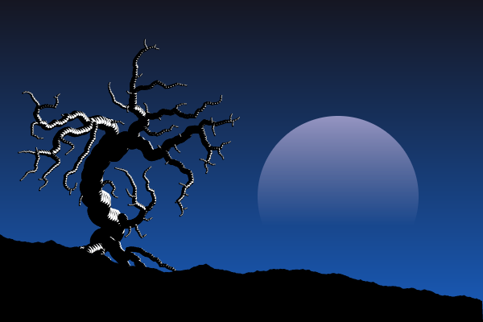
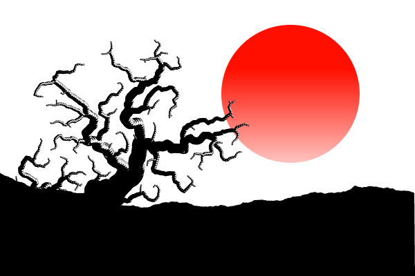
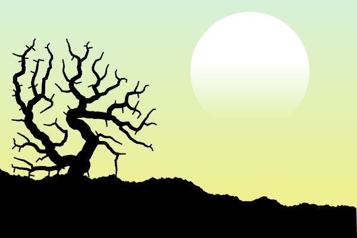
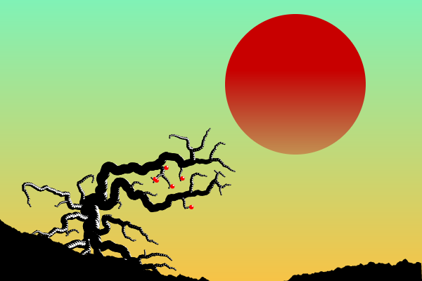

# Generative drawing using venation algorithm
This demo uses an implementation of the venation algorithm to generate drawings.  
Due to the randomness of the algorithm each generated drawing is unique, and there are many parameters to play with both before and after the generation.

## Links
- [Live Demo](https://giladaya.github.io/venation/app/index.html)  
- [View on GitHub](https://github.com/giladaya/venation)
- [Original article](http://algorithmicbotany.org/papers/venation.sig2005.pdf)

## Examples  
  
  
  

*Initial javascript code was adapted from this processing implementation: https://github.com/felixfaire/Venation-Project*